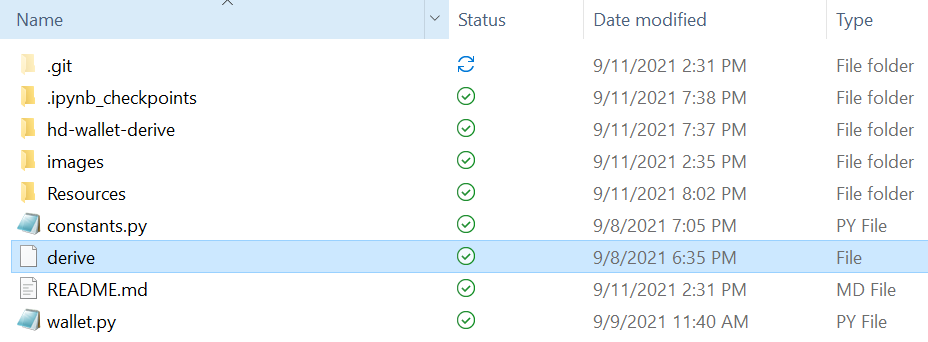

# Multi-Blockchain Wallet in Python

wallet.py is an implementation of multi-crypto asset wallet, that programmatically sends and receives transactions over blockchain networks via virtual wallet that uses the following:
- `hd-wallet-derive` command line tool to derive bip32 addresses and private keys for Bitcoin and many altcoins.
- `web3` module for `Ethereum` and `bit` module for `bitcoin` for the following:
(1) Convert provate key to account 
(2) Prepare an unsigned transaction
(3) Sign the the transaction and send to recipient address


## Dependencies

The following dependencies are required for this wallet to work. 

> **Important:** If you have _not_ already installed the dependencies listed below, you may do so by following the instructions found in the following guides:
  > - [HD Wallet Derive Installation Guide](Resources/HD_Wallet_Derive_Install_Guide.md) 
  > - [Blockchain TX Installation Guide](Resources/Blockchain_TX_Install_Guide.md).

**Dependencies List:**
- PHP must be installed on your operating system.

- You will need to clone the [`repo`](https://github.com/Roy-Tapas/wallet).

- [`bit`](https://ofek.github.io/bit/) Python Bitcoin library.

- [`web3.py`](https://github.com/ethereum/web3.py) Python Ethereum library.


## Instructions

### 1. Project setup

- After cloning the "wallet" repo, `cd` into "wallet" directory in your local machine.

- Install PHP and complete `HD Wallt Derive` by following the instructions in  [HD Wallet Derive Installation Guide](Resources/HD_Wallet_Derive_Install_Guide.md), if not already done.

- Create a symlink called `derive` for the `hd-wallet-derive/hd-wallet-derive.php` script. This will clean up the command needed to run the script in our code, as we can call `./derive` instead of `./hd-wallet-derive/hd-wallet-derive.php`: 

  - Make sure you are in the top level project directory - in this case the directory named `wallet`. 
  
  - **Mac Users:** Run the following command: `ln -s hd-wallet-derive/hd-wallet-derive.php derive`. 
  
  - **Windows Users:** Creating symlinks is not supported by default on Windows, only reading them, so Windows users must perform the following steps:

    - Open up Git-Bash as an administrator (right-click on Git-Bash in the start menu).

    - Within `bash`, run the command `export MSYS=winsymlinks:nativestrict`.
    
    - Run the following command: `ln -s hd-wallet-derive/hd-wallet-derive.php derive`. 

  - Test that you can run the `./derive` script properly, by running the following command.  

    - ```
      ./derive --key=xprv9zbB6Xchu2zRkf6jSEnH9vuy7tpBuq2njDRr9efSGBXSYr1QtN8QHRur28QLQvKRqFThCxopdS1UD61a5q6jGyuJPGLDV9XfYHQto72DAE8 --cols=path,address --coin=ZEC --numderive=3 -g
      ```
  - The output should match what you see below:
    - ```
      +------+-------------------------------------+
      | path | address                             |
      +------+-------------------------------------+
      | m/0  | t1V1Qp41kbHn159hvVXZL5M1MmVDRe6EdpA |
      | m/1  | t1Tw6iqFY1g9dKeAqPDAncaUjha8cn9SZqX |
      | m/2  | t1VGTPzBSSYd27GF8p9rGKGdFuWekKRhug4 |
      +------+-------------------------------------+
      ```

- Your "wallet" directory should look something like this:

  

#### Note the following
- wallet.py is the script used to (a) derive wallet address, private key (b) form raw transactions using web3 or bit libraries for Ethereum and Bitcoin respectively and (c) finally sign and send transactions

- `constants.py` is imported into wallet.py and sets the following constants:
  - `BTC = 'btc'`
  - `ETH = 'eth'`
  - `BTCTEST = 'btc-test'`


### 3. Generate a Mnemonic

- Generate a **new** 12 word mnemonic using `hd-wallet-derive` or by using [this tool](https://iancoleman.io/bip39/).

- Set this mnemonic as an environment variable by the name **"mnemonic"** and store it in a an `.env` file. This should like the following:   
mnemonic = "12 word mnemonic" 

## ALL ENVIRONMENT SETUPS ARE NOW COMPLETE. LET'S NOW SEND SOME TRANSACTIONS BY CALLING FUNCTIONS DEFINED IN wallet.py

- Open up a new terminal window inside of `wallet`.
- Then run the command `python` to open the Python shell. 
- Within the Python shell, run the command `from wallet import *`. This will allow you to access the functions in `wallet.py` interactively.
- You'll need to set the account with  `derive_wallets`, `priv_key_to_account` and use `send_tx` to send transactions.

  - **Bitcoin Testnet transaction**

    - Fund a `BTCTEST` address using [this testnet faucet](https://testnet-faucet.mempool.co/).

    - Use a [block explorer](https://tbtc.bitaps.com/) to watch transactions on the address.
    

    - Send a transaction to another testnet address (either one of your own, or the faucet's) by firing the following commands 
    ```
    >>> derive_wallets(mnemonic,BTCTEST,3)
    >>> BTCTEST_account = priv_key_to_account(BTCTEST, derive_wallets(mnemonic,BTCTEST,3)[0]['privkey'])
    >>> send_tx(BTCTEST,BTCTEST_account,"<< recipient address >>", 0.00001)
    ```
    

    - Screenshot of confirmation of the transaction looks like the following:

      

    
    ***Similar process can be followed for sending transactions in Ethereum testnet ---- WILL BE UPDATED***

