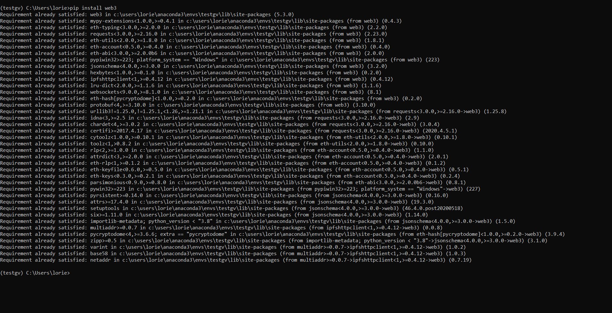
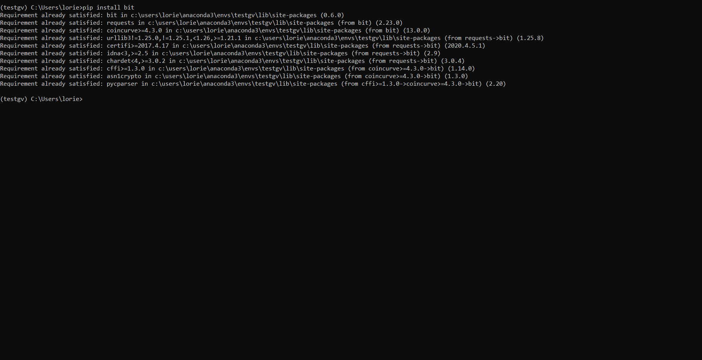
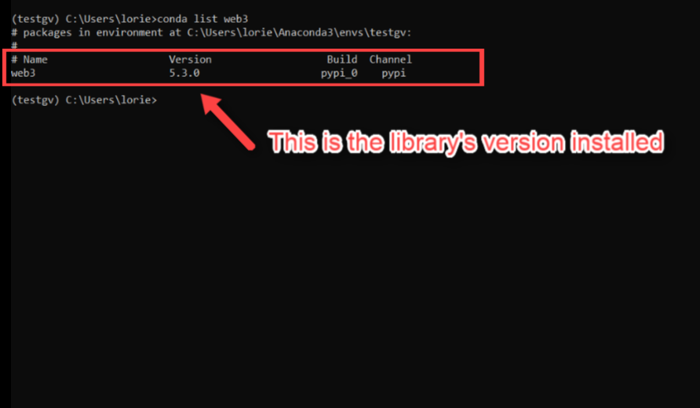
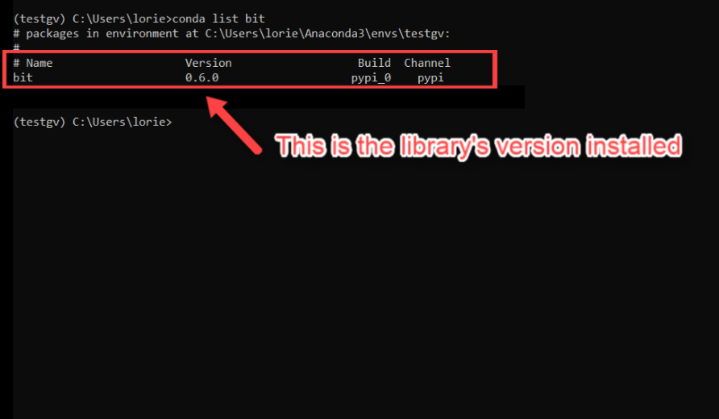

# Blockchain Transactions Install Guide

This guide serves as a step by step process for setting up and validating the [`web3.py`](https://web3py.readthedocs.io/en/stable/), [`bit`](https://ofek.dev/bit/), and [`hd-wallet-derive`](https://github.com/dan-da/hd-wallet-derive  ) libraries used to programmatically send and receive transactions over a blockchain network via virtual wallets. Without these libraries, class activities and their associated code will not be able to perform the necessary operations.

**Important Notes:**

* It is strongly recommended to create a new Python virtual environment for this unit to prevent cross-dependency issues.

* Windows users **MUST** use `git-bash` or _Anaconda Prompt_, and not the default Windows command prompt when you are requested to open the terminal window to execute commands, depending on the type of task to perform.


## Installation Process

Open a terminal and execute the following commands to install `web3.py` and `bit`, respectively. Windows users **MUST** use the _Anaconda Prompt_ in this section.

* Open the terminal and run the following command to create a brand new Python virtual environment for this unit.

  ```shell
  conda create -n ethereum python=3.7 anaconda
  ```

* Activate the new environment.

  ```shell
  conda activate ethereum
  ```

* Use the `pip install` command to download and install the `web3.py` module.

  ```shell
  pip install web3
  ```

  

* Use the `pip install` command to download and install the `bit` module.

  ```shell
  pip install bit
  ```

  

## Verify Installation

Once the `web3.py` and `bit` modules are downloaded and installed, verify that both installations completed successfully. Windows users **MUST** use `git-bash` in this section.

* Use the `conda list package_name` command, substituting `package_name` with `web3` to verify if the `web3` library installed successfully.

  ```shell
  conda list web3
  ```

  

* Use the `conda list package_name` command, substituting `package_name` with `bit` to verify if the `bit` library installed successfully.

  ```shell
  conda list bit
  ```

  


